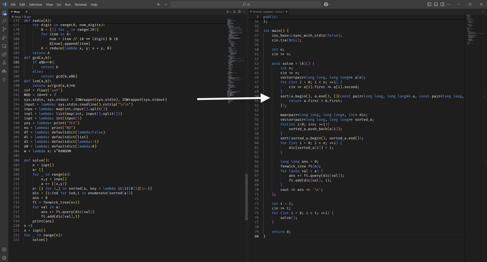

Py2Cpp is a powerful Visual Studio Code extension that uses the Gemini API to seamlessly convert Python3 code into equivalent C++ code. Designed for developers working in both Python and C++, this tool helps automate the translation process, making it faster and easier to port Python projects to C++. Whether you’re translating functions, classes, or entire scripts, Py2Cpp simplifies the process, saving you time and effort. Integrated directly with VS Code, it offers smooth, intuitive code conversion within your development environment.


Here’s a suggested description, usage instructions, and feature list for your extension to include in the VS Code Marketplace:

---

### **Description**  
**Live Python to C++ Converter** is a Visual Studio Code extension that converts Python code to C++ in real-time using the **Google Gemini Generative AI API**. Perfect for developers who want to quickly translate Python logic to C++ syntax without manual effort.  

This extension utilizes the **Google Gemini AI** to provide precise and context-aware code translations and allows users to set their API key directly in the workspace for secure and easy usage.

---

### **How to Use**  
1. **Install the Extension**:
   - Download and install the **Live Python to C++ Converter** extension from the Visual Studio Code Marketplace.

2. **Set Your Google Gemini API Key**:
   - Upon first use, the extension will prompt you to enter your API key.
   - If you need to update your API key later, go to:
     - `File` → `Preferences` → `Settings` → Search for `pythonToCpp.apiKey`.
   - Alternatively, update your workspace settings file directly.

3. **Convert Python Code to C++**:
   - Open a Python file or write Python code in your editor.
   - Press `Ctrl+Shift+P` (or `Cmd+Shift+P` on Mac) and run the command `Convert Python to C++`.
   - The converted C++ code will appear in a new editor tab beside the Python file.

4. **Repeat as Needed**:
   - The extension remembers your API key, so you can easily convert more Python code in future sessions.

---

### **Features**  
1. **Real-Time Python-to-C++ Code Translation**:
   - Converts Python code into C++ using `<bits/stdc++.h>` for simplicity and compatibility.
   - No additional setup or templates required.

2. **Secure API Key Management**:
   - Prompts users to input their Google Gemini API key securely.
   - Stores the API key in workspace settings for future use.

3. **User-Friendly Command**:
   - Simple and intuitive command `Convert Python to C++` accessible via the Command Palette.

4. **Context-Aware Translation**:
   - Uses Google Gemini AI for precise and optimized code conversion based on Python input.

5. **Integrated VS Code Workflow**:
   - Automatically opens the converted C++ code in a side-by-side editor tab for easy comparison.

---

### **Examples**  
#### Input (Python Code):  
```python
def add(a, b):
    return a + b

x = 5
y = 10
print(add(x, y))
```

#### Output (C++ Code):  
```cpp
#include <bits/stdc++.h>
using namespace std;

int add(int a, int b) {
    return a + b;
}

int main() {
    int x = 5;
    int y = 10;
    cout << add(x, y) << endl;
    return 0;
}
```


---

### **Requirements**  
- **Google Gemini API Key**:  
  Obtain an API key from [Google Cloud's Generative AI platform](https://cloud.google.com/genai) and input it into the extension when prompted.

---

### **Release Notes**  
#### Version 0.0.1  
- Initial release of **Live Python to C++ Converter**.
- Features include:
  - API key management.
  - Python-to-C++ conversion using Google Gemini AI.
  - Open converted C++ code in a new tab.

---

### **Keywords**  
`Python`, `C++`, `Code Conversion`, `VS Code Extension`, `Google Gemini AI`, `API`, `Automation`.

---

You can use this as the basis for the `README.md` or as the description in the VS Code Marketplace when publishing your extension. Let me know if you need further refinements or additional sections!

## For more information

https://marketplace.visualstudio.com/items?itemName=GaddalaSathvik.live-py3-to-cpp-converter

**Enjoy!**
